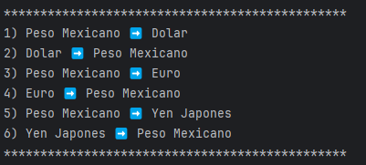

<h1 style="color:#4f608d; font-size:2rem;" align="center"> Conversor de Monedas Alura Latam Reto Java</h1>
<h2 style="font-size:1rem; "  align="center">Daniel Jesus Vadillo Cocom</h2>
 

Este proyecto se basa en la utilización de una API de Monedas, la cual nos funciona para realizar
las conversiones pertinentes en monedas de México, en este caso las monedas que se están convirtieron
fueron:

<ul>
    <li>Yen Japonés</li>
    <li>Dolar Estadounidense</li>
    <li>Euro</li>
    
</ul>

<h2>Imagen del Menú</h2>

<h3 style="color:#1d336c;">Funcionamiento del Programa</h3>
<video src="PruebaCodigo.mp4"></video>
